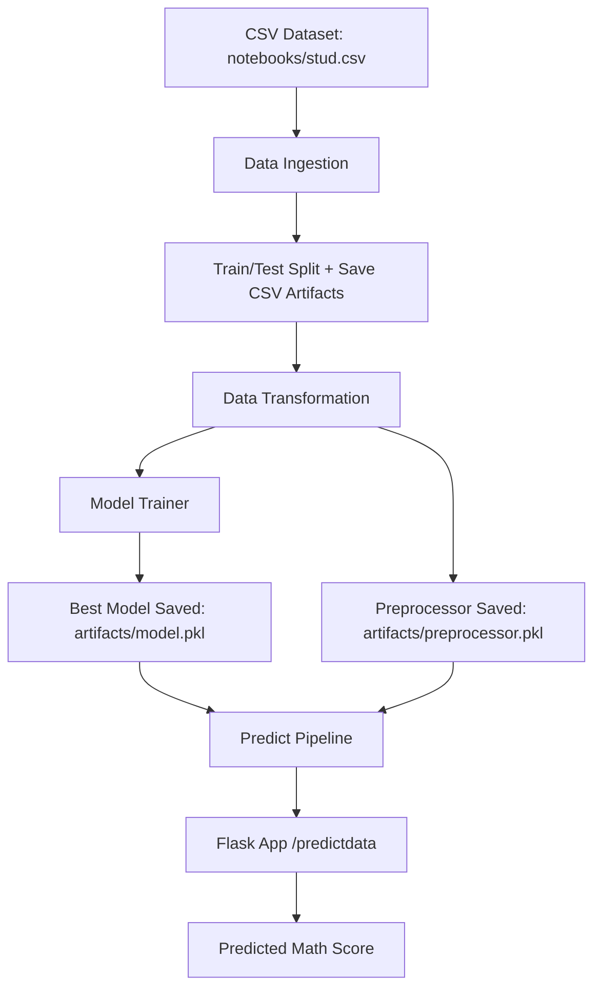
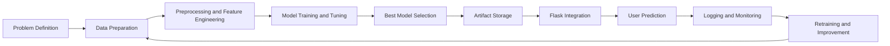

# ML Project Report

## 1. Project Title
Student Exam Performance Prediction System

## 2. Executive Summary
This project is an end-to-end machine learning application that predicts a student's **math score** using demographic and academic input features. The system includes:
- A complete training pipeline
- Data preprocessing and feature engineering
- Multi-model training with hyperparameter tuning
- Model artifact persistence
- A Flask web interface for real-time prediction

The project demonstrates a practical MLOps-style workflow from raw data ingestion to deployment-ready inference.

## 3. Business Problem and Objective
Educational institutions and learners often want early indicators of student performance. This project predicts the math score based on related variables such as reading score, writing score, and contextual categorical features.

**Primary objective:**
Build a reproducible ML pipeline that can train, evaluate, and serve predictions through a user-friendly web application.

## 4. Scope of the Project
### Included
- Data ingestion from CSV
- Train-test split and artifact generation
- Numerical and categorical preprocessing
- Model comparison across multiple regressors
- Hyperparameter tuning using `GridSearchCV`
- Best-model selection based on test R2 score
- Prediction endpoint via Flask

### Not Yet Included
- Automated CI/CD pipeline
- Containerization (Docker)
- Experiment tracking (MLflow/W&B)
- Automated model versioning and rollback
- Authentication for production web deployment

## 5. Dataset Information
- Source file used by training entrypoint: `ML_Project/notebooks/stud.csv`
- Target variable: `math_score`
- Input features used in prediction form:
  - `gender`
  - `race_ethnicity`
  - `parental_level_of_education`
  - `lunch`
  - `test_preparation_course`
  - `reading_score`
  - `writing_score`

## 6. Technology Stack
- Language: Python
- Web Framework: Flask
- Data Processing: pandas, numpy
- Visualization libraries available in environment: matplotlib, seaborn
- Machine Learning: scikit-learn, xgboost, catboost
- Serialization: dill
- Logging: Python `logging`

Deployment-ready dependencies are listed in `ML_Project/requirements-render.txt`:
- pandas
- numpy
- seaborn
- scikit-learn
- dill
- Flask
- matplotlib
- xgboost
- catboost

Note: `ML_Project/requirements.txt` currently contains environment-export style entries and should be cleaned before using it for a fresh local setup.

## 7. Project Structure (Important Modules)
- `ML_Project/main.py`: Training pipeline runner
- `ML_Project/app.py`: Flask application and prediction routes
- `ML_Project/src/components/data_ingestion.py`: Data loading and split logic
- `ML_Project/src/components/data_transformation.py`: Feature preprocessing pipelines
- `ML_Project/src/components/model_trainer.py`: Model selection and training
- `ML_Project/src/Pipeline/train_pipeline.py`: Orchestrates training flow
- `ML_Project/src/Pipeline/predict_pipeline.py`: Loads artifacts and predicts
- `ML_Project/src/utils.py`: Utility helpers (`save_object`, `load_object`, evaluation)
- `ML_Project/src/exception.py`: Custom exception formatting
- `ML_Project/src/logger.py`: Timestamped logging configuration
- `ML_Project/templates/`: HTML pages for UI
- `ML_Project/artifacts/`: Generated train/test/raw data + model/preprocessor files
- `ML_Project/logs/`: Runtime logs

## 8. System Workflow
1. Data is read from CSV in the ingestion component.
2. Train and test datasets are created and saved into `artifacts`.
3. Transformation component builds separate numerical and categorical pipelines:
   - Numerical: median imputation + scaling
   - Categorical: mode imputation + one-hot encoding + scaling
4. The preprocessor object is saved as `artifacts/preprocessor.pkl`.
5. Multiple regression models are trained and tuned.
6. Best model is selected using test R2 score.
7. Best model is saved as `artifacts/model.pkl`.
8. Flask app receives form data, constructs a dataframe, applies preprocessor, and returns predicted math score.

## 8A. End-to-End Project Workflow
This workflow captures the practical lifecycle followed in this project from development to inference.

### Phase 1: Requirement and Problem Definition
1. Define prediction objective: estimate `math_score` for a student.
2. Identify usable features from available dataset columns.
3. Set success metric: test-set $R^2$ score.

### Phase 2: Data Preparation
1. Load dataset from `notebooks/stud.csv`.
2. Split data into train and test partitions.
3. Store split files in `artifacts/` for reproducibility.

### Phase 3: Feature Engineering and Preprocessing
1. Separate numerical and categorical columns.
2. Build numerical pipeline (imputation + scaling).
3. Build categorical pipeline (imputation + one-hot encoding + scaling).
4. Combine pipelines using a column transformer.
5. Save fitted preprocessor as `artifacts/preprocessor.pkl`.

### Phase 4: Model Training and Selection
1. Train multiple regression models.
2. Perform hyperparameter tuning with `GridSearchCV`.
3. Compare model performance using test-set $R^2$.
4. Apply quality gate (minimum acceptable score).
5. Save best model as `artifacts/model.pkl`.

### Phase 5: Integration and Serving
1. Build Flask routes for home page and prediction endpoint.
2. Collect user inputs from HTML form.
3. Convert inputs into dataframe format expected by pipeline.
4. Load preprocessor and model artifacts.
5. Return predicted math score on the UI.

### Phase 6: Monitoring and Improvement Loop
1. Capture pipeline and runtime logs in `logs/`.
2. Review model performance periodically.
3. Retrain when data characteristics shift or performance drops.
4. Improve with testing, validation, and deployment automation.

## 9. Modeling Strategy
### Candidate Models
- Linear Regression
- Decision Tree Regressor
- Random Forest Regressor
- Gradient Boosting Regressor
- AdaBoost Regressor
- K-Nearest Neighbors Regressor
- Optional heavy models (enabled by env var):
  - XGBoost Regressor
  - CatBoost Regressor

### Selection Logic
- Each model is evaluated after tuning with predefined parameter grids.
- Best model is chosen by highest test-set R2 score.
- Guard condition: if best score < 0.6, training fails to prevent weak deployment.

## 10. Logging and Error Handling
- Logging is configured with timestamp-based log filenames under `logs/`.
- A custom exception class provides file name and line number context for easier debugging.
- This improves traceability and maintainability of pipeline failures.

## 11. Deployment and Usage
### Local Setup
1. Navigate to project folder:
   - `cd ML_Project`
2. Install dependencies:
   - `pip install -r requirements-render.txt`

### Train the model
- `python main.py`

### Run the web app
- `python app.py`

### Use the app
- Open browser at `http://127.0.0.1:5000/`
- Go to prediction form
- Enter feature values
- Get predicted math score

### Cloud Deployment (Render)
- Live application URL: https://ml-project-g7m8.onrender.com/
- Deployment platform: Render (Python web service)
- Entry command: `gunicorn app:app`
- Note: On free tier, first request can be slow due to cold start and may briefly return 503.

## 12. Key Deliverables Produced by the Project
- Reusable training pipeline
- Saved model artifact (`model.pkl`)
- Saved transformation pipeline (`preprocessor.pkl`)
- Web-based prediction interface
- Structured logs for monitoring and debugging

## 13. Strengths of the Current Implementation
- Clear modular structure (`components`, `Pipeline`, `utils`)
- Train and inference code paths are separated
- Supports multiple algorithms with tuning
- Includes practical model quality threshold
- Artifacts and logs are organized for reproducibility

## 14. Gaps and Recommended Enhancements
1. Add unit and integration tests for pipeline components.
2. Add data validation checks (schema, range checks, missing distribution).
3. Add experiment tracking (MLflow) for model comparison history.
4. Create a clean, portable `requirements.txt` for local development setup.
5. Add Dockerfile and CI/CD pipeline for repeatable automated releases.
6. Improve frontend styling and user input feedback/validation messages.
7. Version artifacts with timestamp/hash-based model registry pattern.
8. Add API endpoint versioning and health-check endpoint.

## 15. Conclusion
This ML project is a strong foundational implementation of an end-to-end supervised learning system for educational score prediction. It already demonstrates production-relevant engineering practices such as modular architecture, artifact management, logging, and exception handling. With testing, validation, and deployment automation enhancements, it can be elevated from a strong portfolio project to a robust production-grade solution.

---

### Appendix A: High-Level Architecture

### Appendix B: Lifecycle Workflow Diagram

